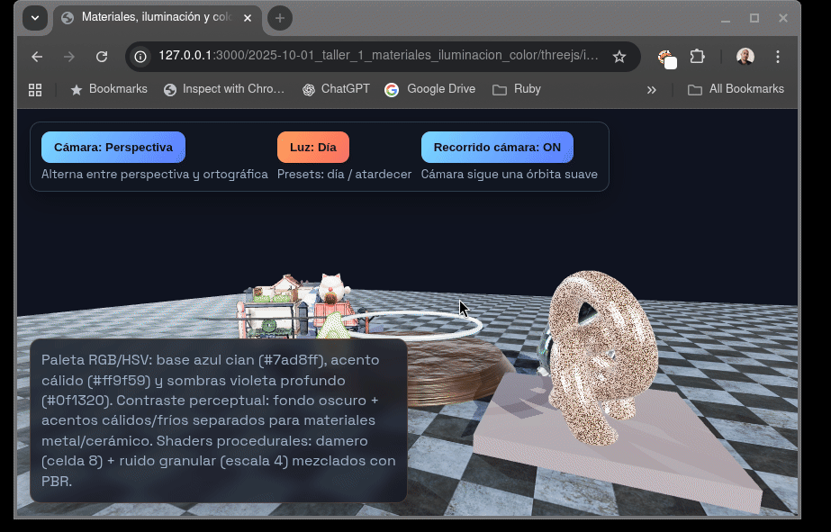

# Taller 1 — Materiales por Iluminación y Modelos de Color (Three.js)

## 1. Concepto del mundo

El mundo virtual desarrollado se concibe como un **espacio de exhibición de materiales**, donde diferentes familias de objetos (arquitectónicos, utilitarios y orgánicos) coexisten en un escenario controlado para **analizar cómo la iluminación y el modelo de color modifican la percepción de los materiales**.

La escena no busca realismo narrativo, sino **claridad perceptual**: cada objeto representa un caso distinto de materialidad (metal, cerámica/superficie rugosa, material orgánico), permitiendo comparar de forma directa el efecto de los cambios de luz, color y cámara.

---

## 2. Modelos GLB utilizados

| Tipo           | Modelo         | Fuente                     | Transformaciones                | Observaciones                                        |
| -------------- | -------------- | -------------------------- | ------------------------------- | ---------------------------------------------------- |
| Arquitectónico | Littlest Tokyo | Three.js Examples          | Escala: 0.015, Rotación Y: +30° | Sirve como referencia arquitectónica y de escala     |
| Utilitario     | Damaged Helmet | Khronos glTF Sample Models | Escala: 1.75, Rotación Y: -60°  | Material metálico complejo con mapas PBR             |
| Orgánico       | Avocado        | Khronos glTF Sample Models | Escala: 22, Rotación Y: +45°    | Forma orgánica para contrastar con superficies duras |

Todos los modelos fueron reescalados y orientados para mantener coherencia visual dentro del mismo espacio.

---

## 3. Iluminación

La escena utiliza un esquema de **tres puntos de iluminación** complementado con luz ambiental y un entorno HDRI.

### Esquema base

* **Key Light (Directional)**: luz principal que define forma y volumen.
* **Fill Light (Directional)**: reduce sombras duras y equilibra contraste.
* **Rim Light (Directional)**: resalta siluetas y bordes, especialmente en materiales metálicos.
* **Ambient Light + Hemisphere Light**: control de iluminación global.
* **HDRI**: aporta reflejos realistas en materiales PBR.

### Presets

**Preset Día**

* Colores más neutros y fríos.
* Mayor intensidad general.
* Permite observar con claridad roughness y normal maps.

**Preset Atardecer**

* Key cálida y fill fría.
* Intensidad reducida y mayor contraste.
* Resalta especularidad en metales y sombras largas en superficies rugosas.

El cambio de preset se realiza dinámicamente desde la interfaz.

---

## 4. Materiales y texturas (PBR)

Se emplean materiales **MeshStandardMaterial** con parámetros diferenciados:

| Objeto  |      Roughness |      Metalness | Normal Map | Justificación                                          |
| ------- | -------------: | -------------: | ---------- | ------------------------------------------------------ |
| Suelo   |            0.8 |           0.05 | Sí         | Superficie mate que evidencia sombras y luz rasante    |
| Podio   |           0.35 |            0.5 | Sí         | Material semi-metálico con respuesta especular visible |
| Helmet  | Variable (GLB) | Variable (GLB) | Sí         | Caso de referencia PBR completo                        |
| Avocado | Bajo metalness | Alto roughness | Sí         | Material orgánico difuso                               |

Los materiales reaccionan de forma distinta al cambiar entre los presets de iluminación.

---

## 5. Shaders y texturas procedurales

Se implementan **texturas procedurales generadas por código** y combinadas con PBR:

* **Damero (Checker Texture)**

  * Tamaño de celda: 8
  * Aplicado a una esfera
  * Permite leer escala y continuidad superficial

* **Ruido granular (Noise Texture)**

  * Resolución: 256×256
  * Escala: 4
  * Aplicado a un TorusKnot
  * Introduce variación visual y rompe uniformidad del material

Ambas texturas se combinan con normal maps y parámetros PBR para mantener coherencia física.

---

## 6. Cámaras

La escena dispone de dos cámaras intercambiables:

* **Cámara Perspectiva**

  * Aporta profundidad, escala y dramatismo.
  * Adecuada para apreciar iluminación y composición espacial.

* **Cámara Ortográfica**

  * Elimina distorsión de perspectiva.
  * Facilita el análisis formal de materiales y patrones procedurales.

La alternancia se realiza mediante un botón en la interfaz.

---

## 7. Animaciones

Se integran animaciones continuas con intención perceptual:

* **Cámara**: recorrido orbital suave alrededor de la escena.
* **Luz Rim**: movimiento circular que revela cambios de especularidad.
* **Objetos**:

  * Rotación de la esfera con damero.
  * Rotación del TorusKnot con ruido.
  * Rotación lenta del aro luminoso central.

Estas animaciones permiten observar cómo los materiales responden dinámicamente a la luz y al movimiento.

---

## 8. Modelo de color

### Paleta base (RGB / HSV)

* Azul cian (#7ad8ff): color principal
* Naranja cálido (#ff9f59): acento
* Violeta oscuro (#0f1320): fondo y sombras

### Contraste perceptual (CIELAB – conceptual)

* Fondo oscuro con baja luminosidad (L*)
* Acentos cálidos y fríos con alto contraste perceptual
* Separación clara entre materiales metálicos y cerámicos mediante color y brillo

El modelo de color refuerza la lectura material sin depender únicamente de la geometría.

---

## 9. Evidencias

---

## 10. Conclusión

El proyecto demuestra cómo la **iluminación, los modelos de color y los materiales PBR** interactúan para modificar la percepción visual de un mundo virtual. Más allá de la estética, la escena está diseñada como una herramienta de análisis visual que evidencia principios fundamentales de **computación gráfica e iluminación en tiempo real**.
