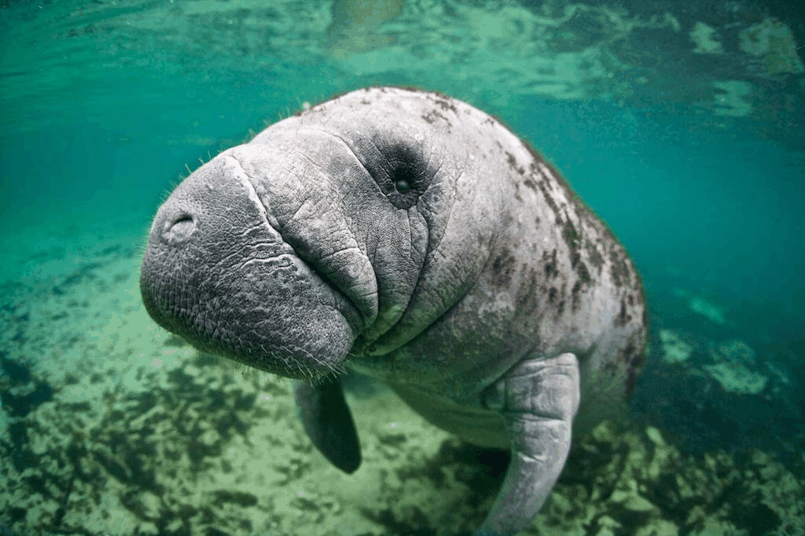

# Examen final

## 1. **Punto 1 – Python:**

En este punto utilizo OpenCV con la imagen del un Manatí (un animal en peligro de extinción) para aplicar varios filtros y operaciones morfológicas, y finalmente generar un GIF que muestre los resultados. La imagen del manatí tiene una piel arrugada en la naríz y un fondo difuso lo cual permite observar los efectos de los filtros y operaciones morfológicas aplicadas. También al ser una imagen submarina con vegetación, permite observar los efectos de la separación de canales de color.



### 2. **Punto 2 – Three.js:**

Para es punto se utilizó Three.js para renderizar 4 objetos 3: un cono, un cubo, un toroide y una caja con textura de caja. Se renderiza también un piso con una textura de tablaro de ajedre vieja y se configura para alternar entre camara ortogonal y perspectiva.


### 3. **Instrucciones de ejecución:**

#### Python
Ejecute las siguientes dependencias para correr el notebook de Python:

```bash
sudo apt-get update && sudo apt-get install -y libgl1 libglib2.0-0
pip install opencv-python matplotlib numpy imageio
```

Luego abra y ejecute el notebook `examen_final/python/examen_final_python.ipynb` utilizando Jupyter Notebook o Jupyter Lab.


#### Three.js

Abra el


